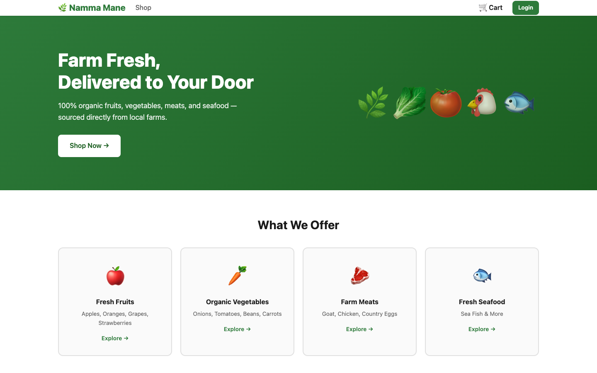
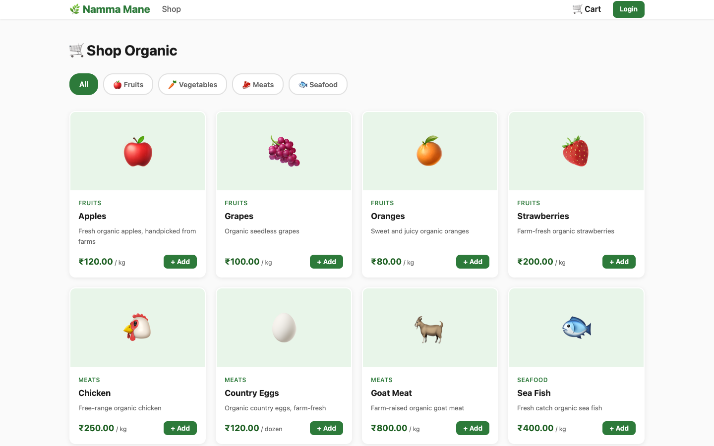
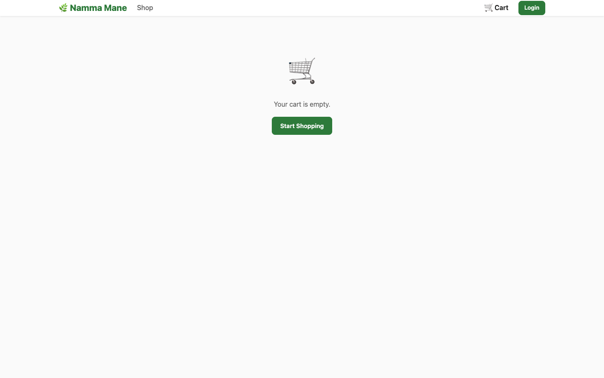
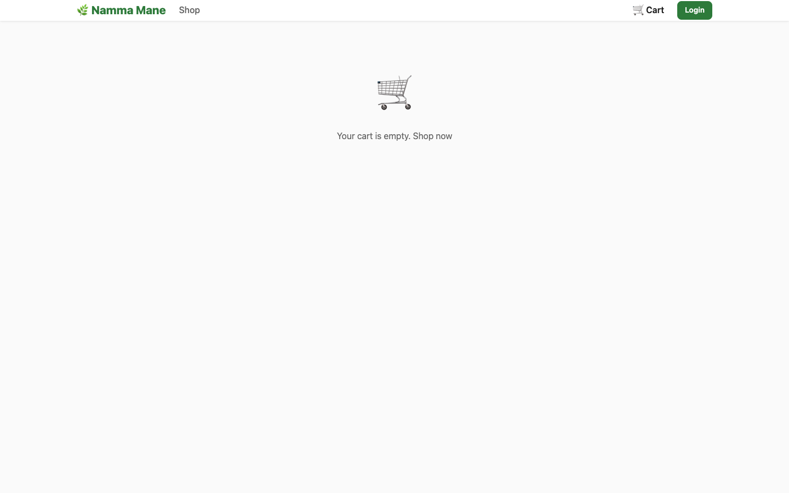
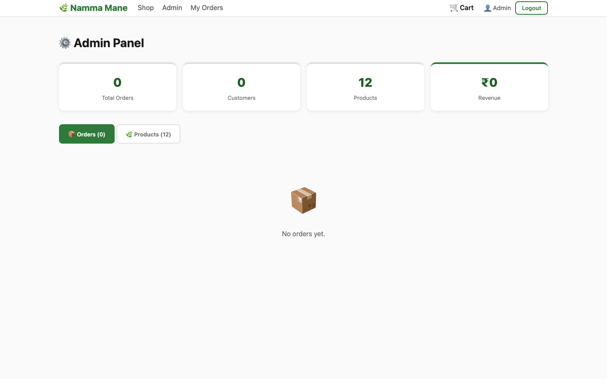
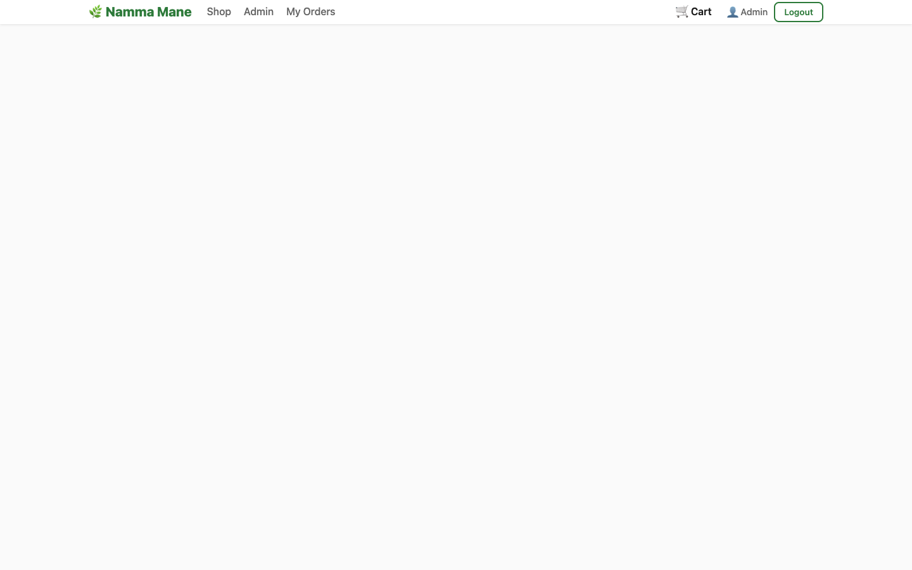

# 🌿 Namma Mane — Organic Farm Fresh Delivery

A full-stack web app for ordering organic fruits, vegetables, meats, and seafood directly from local farms.

## Screenshots

| Home | Products |
|---|---|
|  |  |

| Cart | Checkout |
|---|---|
|  |  |

| Admin Dashboard | Order Management |
|---|---|
|  |  |

> Replace the placeholder images above with actual screenshots after running the app.

## Features

- **Customer** — Register/Login, browse products by category, add to cart, checkout (guest or logged-in), track orders
- **Admin** — Dashboard with stats, manage orders (update status), manage products (add/edit/delete)

## Tech Stack

| Layer | Tech |
|---|---|
| Frontend | React 18 + Vite |
| Backend | Node.js + Express |
| Database | PostgreSQL |
| Auth | JWT + bcrypt |
| State | React Context API |

## Product Catalog

| Category | Products |
|---|---|
| 🍎 Fruits | Apples, Oranges, Grapes, Strawberries |
| 🥕 Vegetables | Onions, Tomatoes, Beans, Carrots |
| 🥩 Meats | Goat Meat, Chicken, Country Eggs |
| 🐟 Seafood | Sea Fish |

## Getting Started

### Prerequisites

- Node.js 18+
- PostgreSQL 16+

### 1. Clone the repo

```bash
git clone https://github.com/saikiran146/namma-mane.git
cd namma-mane
```

### 2. Set up the backend

```bash
cd backend
npm install
cp .env.example .env
```

Edit `.env` with your database credentials:

```env
PORT=3001
DATABASE_URL=postgresql://YOUR_USER@localhost:5432/namma_mane
JWT_SECRET=your_secret_key_here
FRONTEND_URL=http://localhost:5173
```

### 3. Set up the database

```bash
createdb namma_mane
node src/db/init.js
```

### 4. Set up the frontend

```bash
cd ../frontend
npm install
```

### 5. Run the app

```bash
# Terminal 1 — backend
cd backend && node src/index.js

# Terminal 2 — frontend
cd frontend && npm run dev
```

Open **http://localhost:5173**

## Default Admin Account

| Field | Value |
|---|---|
| Email | admin@namma-mane.com |
| Password | admin123 |

> Change the admin password after first login.

## Project Structure

```
namma-mane/
├── backend/
│   ├── src/
│   │   ├── db/          # Schema, seed, DB connection
│   │   ├── middleware/  # JWT auth
│   │   ├── routes/      # auth, products, orders, admin
│   │   └── index.js
│   └── .env.example
└── frontend/
    └── src/
        ├── api/         # Axios API calls
        ├── components/  # Navbar
        ├── context/     # Auth + Cart context
        └── pages/       # Home, Products, Cart, Checkout, Admin, etc.
```

## API Endpoints

| Method | Endpoint | Description |
|---|---|---|
| POST | `/api/auth/register` | Register new user |
| POST | `/api/auth/login` | Login |
| GET | `/api/products` | List products (filter by `?category=`) |
| POST | `/api/orders` | Place order (guest or logged-in) |
| GET | `/api/orders/my` | My order history |
| GET | `/api/admin/stats` | Admin dashboard stats |
| GET | `/api/admin/orders` | All orders |
| PUT | `/api/admin/orders/:id/status` | Update order status |
| GET/POST | `/api/admin/products` | List / add products |
| PUT/DELETE | `/api/admin/products/:id` | Edit / delete product |

## License

MIT
